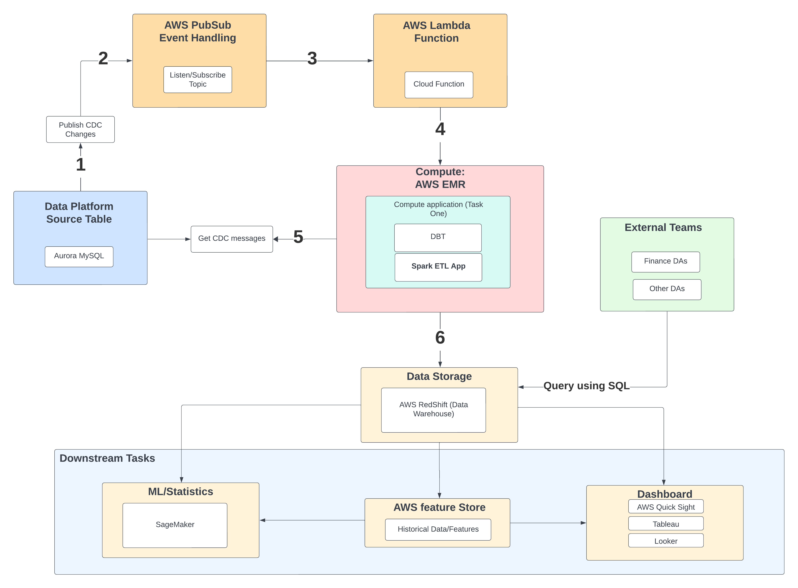

# Task Two: System Design

## Overview

After successfully developing an ETL job, our focus now shifts to architecting a robust production system capable of consistently extracting data from the source systems and providing up-to-date and historical data to data analysts (mainly SQL focused).

## Key points need to consider:
- Data Storage: Current data is stored in AWS Aurora MySQL databases.
- Change Data Capture (CDC): Planned to be enabled within the next 12 months, with CDC events to be streamed to Kafka (Kafka API supports).
- Analytical Needs: Analysts require access to historical views of data and features (e.g., comparisons between data from one month ago and today).
- External Squad (Finance Team) Requirements: Interested primarily in invoice data and proficient only in SQL.





## Data Source: AWS Aurora MySQL
AWS Aurora MySQL is a third-party SQL database integration on AWS (similar to Google Cloud SQL for MySQL). I will consider based on the fact that AWS supports integrations well with MySQL databases with multiple AWS supplied features.

## Data Processing and Workflow Management
### Deploying Spark on AWS EMR

- AWS Elastic MapReduce (EMR): Native support for environment configurations, auto-scaling, and executions. EMR is ideal for deploying our PySpark application developed in Task One.
- Local Testing: Docker (provided in task one) will be utilised for local testing environments to ensure consistency, though it is not required for cloud execution due to the managed nature of AWS EMR services.


### EMR Cluster Setup:
- Initialize an EMR cluster to host our PySpark application.
  ```bash
  aws emr create-cluster --name "Spark Cluster" --use-default-roles
  ```


### Job Triggering:

##### Real-Time:
- Real-Time execution can be costly, depends on update frequency, need to ensure long run cost is with-in budget.
- Overhead in spinning up Spark cluster and setup.
- AWS Lambda: Trigger EMR jobs using Lambda functions (similar to cloud function on GCP), enabling responsive data processing based on event, which can be setup to fire from Aurora MySQL database.
- Amazon Pub/Sub: (Google Pub/Sub) to trigger Lambda functions, ensures real-time data processing and spark execution as soon as updates occur in Aurora MySQL.
  

##### Batch, Scheduled:
- Scheduled Tasks: AWS App Runner for regularly scheduled jobs (Google Cloud Run), that automatically run our spark application every x days.


### Data Storage and Querying: AWS RedShift
- AWS RedShift (Bigquery on Google, Delta lake on Databricks) will serve as our data warehouse, providing extensive SQL query capabilities for external squad (such as finance teams). 
- Setting up IAM and project access to ensure external access is controlled.
- Can also setup `dev, test, prod` environment so we can safely test new features without interrupting other squad's work.


### Version Control(Time Travel): 
- Use table snapshots, time-travel features.
- Use an ingest_ts column for managing incremental updates effectively.
- Use Amazon SageMaker Feature Store.
    - Store processed features independently, allowing shared access across different teams (finance team).
    - Automate feature updates upon new data arrivals, integrating with RedShift for ML model training or dashboard serving.

### Visualisation and Reporting: AWS QuickSight
- QuickSight (Looker, Tableau alternative)
- Provided on AWS can be directly integrated with RedShift, UI select tables to connect etc, to meet the reporting needs of our teams.


### CDC, Incremental and Real-Time Data Management Strategies

#### Change Data Capture (CDC):

Once the data platform team enabled CDC to capture data changes incrementally, we will have continuously supplied new data.
Please see `cdc_demo.py` for high-level logic overview and sample code.


The demo uses DBT and Spark for merging and appending data rather than overwriting all existing data, which optimised resource usage and operational costs.

#### Data Append Strategy (Redshift Connector):

```python
# Append data to RedShift using PySpark
redshift_url = "jdbc:redshift://<cluster-endpoint>:5439/<database>"
redshift_properties = {
    "user": "<username>",
    "password": "<password>",
    "driver": "com.amazon.redshift.jdbc.Driver"
}
df_result.write.jdbc(url=redshift_url, table="intermediate_invoices", mode="append", properties=redshift_properties)
```

## Conclusion

The proposed system architecture is meticulously designed to address both the current and future data processing needs of the organization. By leveraging AWS's powerful suite of services, this solution ensures scalability, flexibility, and efficiency, positioning us to dynamically adapt to changing data volumes and processing requirements.